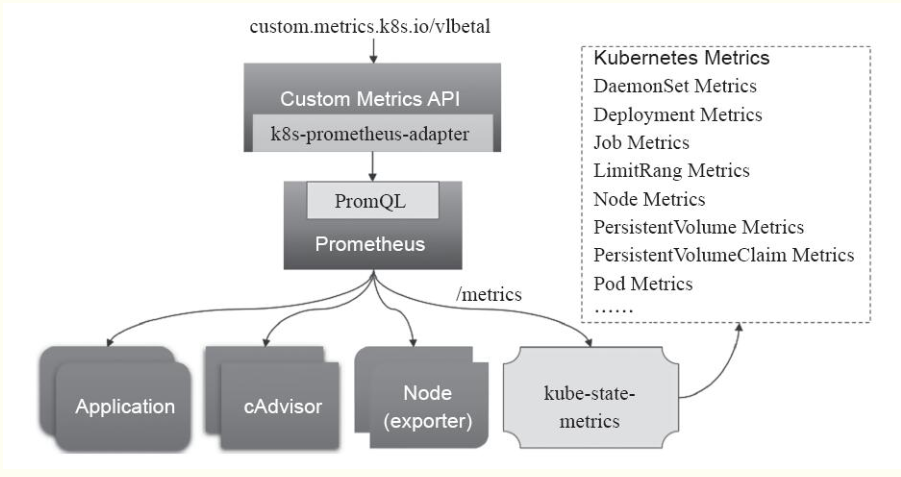

#### 部署prometheus

除了常规的核心资源指标,用户需要了解更多的指标资源,如k8s指标，更全面的容器指标，更全面的节点指标以及应用程序指标

 

任何被监控的目标都需要通过配置信息以静态形式指定或者动态发现管理机制，prometheus支持从多个监控目标采集“非核心指标”

- node_exporter: 收集标准的主机指标，包括cpu，memory，disk，network
- kubelet(cadvisor): 收集容器指标数据，属于核心指标
- API server: 收集API server的性能指标数据，包括工作队列的性能
- kube-state-metrics： 此组件能够相关的多个指标数据，包括指定类型的对象总数，资源限额，容器状态


#### 部署prometheus

```yaml
cd /data/k8s/
git clone https://github.com/coreos/kube-prometheus.git
cd kube-prometheus/
sed -i -e 's_quay.io_quay.azk8s.cn_' manifests/*.yaml manifests/setup/*.yaml 
kubectl apply -f manifests/setup # 安装 prometheus-operator
kubectl apply -f manifests/ # 安装 promethes metric adapter
```


#### 查看运行状态

```yaml
[root@test242 ~]# kubectl  get pods -n monitoring
NAME                                   READY   STATUS    RESTARTS   AGE
alertmanager-main-0                    2/2     Running   0          23m
alertmanager-main-1                    2/2     Running   0          23m
alertmanager-main-2                    2/2     Running   0          23m
grafana-8878f84fd-w52dz                1/1     Running   0          24m
kube-state-metrics-9cdc46894-k8cj6     1/1     Running   0          24m
node-exporter-9bxk8                    2/2     Running   0          24m
node-exporter-9pdpv                    2/2     Running   0          24m
node-exporter-hfmjb                    2/2     Running   0          24m
node-exporter-n8r72                    2/2     Running   0          24m
prometheus-adapter-578bbdff78-trtms    1/1     Running   0          24m
prometheus-k8s-0                       3/3     Running   1          23m
prometheus-k8s-1                       3/3     Running   1          23m
prometheus-operator-77c45c57f9-9gwkx   1/1     Running   0          24m
```


#### 设置访问的svc

```yaml
[root@test242 ~]# kubectl  get svc -n monitoring
NAME                    TYPE        CLUSTER-IP      EXTERNAL-IP   PORT(S)                      AGE
alertmanager-main       ClusterIP   10.102.98.13    <none>        9093/TCP                     4h16m
alertmanager-operated   ClusterIP   None            <none>        9093/TCP,9094/TCP,9094/UDP   4h16m
grafana                 NodePort    10.99.163.25    <none>        3000:31762/TCP               4h16m
kube-state-metrics      ClusterIP   None            <none>        8080/TCP,8081/TCP            4h16m
node-exporter           ClusterIP   None            <none>        9100/TCP                     4h16m
prometheus-adapter      ClusterIP   10.98.135.122   <none>        443/TCP                      4h16m
prometheus-k8s          NodePort    10.111.35.117   <none>        9090:30088/TCP               4h16m
prometheus-operated     ClusterIP   None            <none>        9090/TCP                     4h16m
prometheus-operator     ClusterIP   None            <none>        8080/TCP                     4h16m
```


#### 配置pod监控页面


#### 配置cluster监控页面


#### 配置node监控页面


